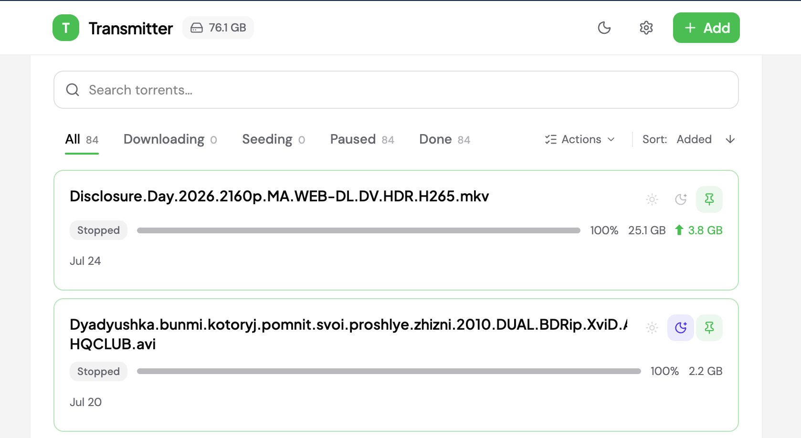
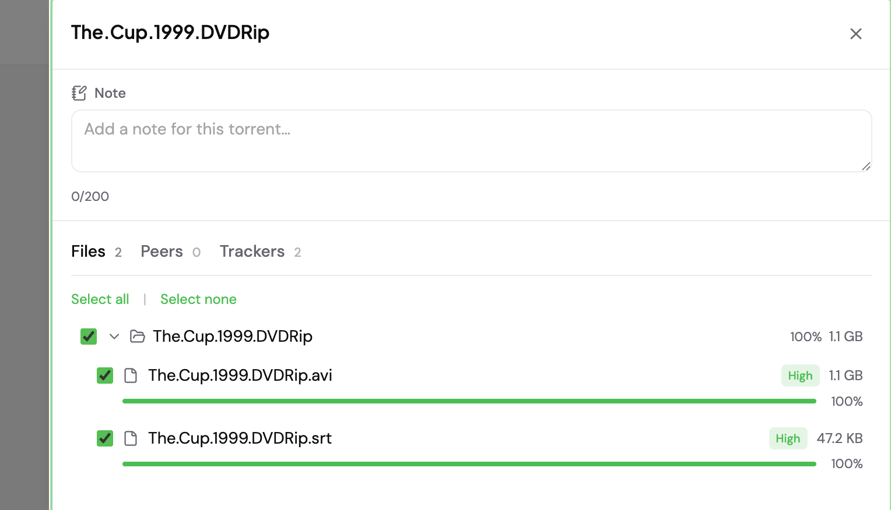

# Transmitter




Transmitter ist eine moderne, schlanke Alternative zur Standard-Weboberfläche von Transmission. Läuft ohne externe Abhängigkeiten. Beinhaltet außerdem eine Telegram-Bot-Integration.

## Funktionen

- **Torrent-Liste** — sortierbare Tabelle: Name, Status, Fortschritt, Größe, Geschwindigkeit, Hinzugefügt, ETA
- **Statusfilter** — Alle, Lädt herunter, Seeding, Pausiert, Fertig
- **Suche** — Torrents nach Name filtern (Groß-/Kleinschreibung ignoriert)
- **Torrents hinzufügen** — Magnet-Links oder .torrent-Datei-Upload
- **Verwaltung** — Torrents pausieren, fortsetzen, löschen
- **Notizen** — beliebiger Text zu jedem Torrent (serverseitig in SQLite gespeichert, sichtbar in der Liste, im Detailbereich und im Telegram-Bot)
- **Nachtschicht** — markierte Torrents werden nur im konfigurierten Zeitfenster heruntergeladen und geseedet; außerhalb werden sie pausiert
- **Auto-Aktualisierung** — Live-Updates alle 3–5 Sekunden
- **Unterstützte Sprachen**: en, ru, es, de
- **Docker images**: linux/amd64, linux/arm/v7, linux/arm64/v8

## Erste Schritte

```bash
cp .env.example .env

# .env nach Bedarf anpassen

docker-compose up -d
```

Browser öffnen: `http://localhost:8080`

### Konfiguration

Alle Einstellungen über Umgebungsvariablen:

| Variable | Erforderlich | Standard |
|-----------|--------------|---------|
| `TRANSMISSION_USER` | Ja | — |
| `TRANSMISSION_PASS` | Ja | — |
| `TRANSMISSION_URL` | Nein | `http://localhost:9091/transmission/rpc` |
| `LISTEN_ADDR` | Nein | `127.0.0.1:8080` (Docker-Image: `0.0.0.0:8080`) |
| `CORS_ORIGIN` | Nein | `http://localhost:8080` |
| `WEBUI_ENABLED` | Nein | `true` |
| `TELEGRAM_BOT_ENABLED` | Nein | `false` |
| `TELEGRAM_TOKEN` | Bei Bot-Nutzung | — |
| `TELEGRAM_USERS` | Bei Bot-Nutzung | — |
| `LOG_LEVEL` | Nein | `info` |
| `FILE_PRIORITY_ENABLED` | Nein | `false` |
| `FILE_PRIORITY_HIGH_COUNT` | Nein | `3` |
| `NIGHT_SHIFT_START` | Nein | — (deaktiviert) |
| `NIGHT_SHIFT_END` | Nein | — (deaktiviert) |
| `NIGHT_SHIFT_INTERVAL` | Nein | `1m` |
| `DB_PATH` | Nein | `data/transmitter.db` (Docker-Image: `/app/data/transmitter.db`) |
| `TORRENT_NOTE_MAX_LENGTH` | Nein | `200` |
| `TORRENT_NOTE_CLEANUP_INTERVAL` | Nein | `1h` |
| `SENTRY_DSN` | Nein | — (deaktiviert) |
| `SENTRY_ENVIRONMENT` | Bei Verwendung von Sentry | — |

Alle Optionen siehe [.env.example](.env.example).

## Sicherheit

Siehe [SECURITY.md](docs/SECURITY.de.md).

## Roadmap

- Web-UI-Authentifizierung
- Video plugin
- Unterstützung mehrerer Transmission-Instanzen
- RSS-Feeds für automatisches Hinzufügen von Torrents
