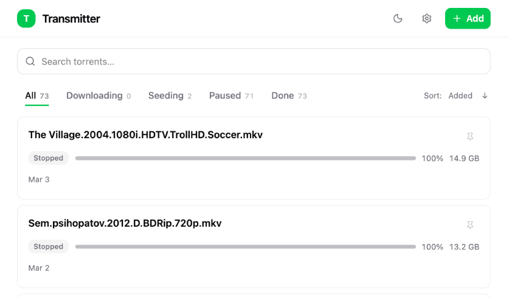

# Transmitter

[Русский](README.ru.md) | [Español](README.es.md) | [Deutsch](README.de.md)



Transmitter is a modern, lightweight alternative to Transmission's stock UI. Runs with zero external dependencies. Also Telegram bot integration.

## Features

- **Torrent list** — sortable table: name, status, progress, size, speed, added date, ETA
- **Status filters** — All, Downloading, Seeding, Paused, Done
- **Search** — filter torrents by name (case-insensitive)
- **Add torrents** — magnet links or .torrent file upload
- **Management** — pause, resume, delete torrents
- **Auto-refresh** — live updates every 3–5 seconds
- **Support locales**: en, ru, es, de

## Getting Started

```bash
cp .env.example .env

# edit .env for your needs

docker-compose up -d
```

Open browser: `http://localhost:8080`

### Configuration

All settings via environment variables:

| Variable | Required | Default |
|-----------|----------|---------|
| `TRANSMISSION_USER` | Yes | — |
| `TRANSMISSION_PASS` | Yes | — |
| `TRANSMISSION_URL` | No | `http://localhost:9091/transmission/rpc` |
| `LISTEN_ADDR` | No | `:8080` |
| `CORS_ORIGIN` | No | `http://localhost:8080` |
| `WEBUI_ENABLED` | No | `true` |
| `TELEGRAM_BOT_ENABLED` | No | `false` |
| `TELEGRAM_TOKEN` | If using bot | — |
| `TELEGRAM_USERS` | If using bot | — |
| `LOG_LEVEL` | No | `info` |
| `FILE_PRIORITY_ENABLED` | No | `false` |
| `FILE_PRIORITY_HIGH_COUNT` | No | `3` |

For all options, see [.env.example](.env.example).

## Security

See [SECURITY.md](docs/SECURITY.md).

## Roadmap

- Web UI authentication (Basic Auth middleware) for external access via VPN
- Movie extensions
- Support multiple Transmission instances
- RSS feeds for automatic torrent addition
