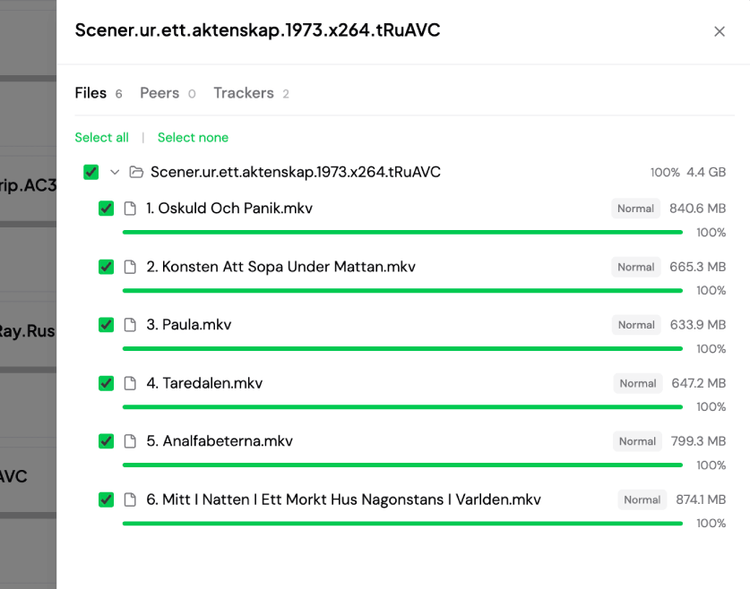

# Transmitter




Transmitter — современная и лёгкая альтернатива стандартному веб-интерфейсу Transmission. Работает без внешних зависимостей. Также поддерживает интеграцию с Telegram-ботом.

## Возможности

- **Список торрентов** — сортируемая таблица: имя, статус, прогресс, размер, скорость, дата добавления, ETA
- **Фильтры по статусу** — Все, Загрузка, Раздача, Приостановлено, Завершено
- **Поиск** — фильтрация торрентов по имени (без учёта регистра)
- **Добавление торрентов** — магнет-ссылки или загрузка .torrent-файлов
- **Управление** — пауза, возобновление, удаление торрентов
- **Авто-обновление** — обновление в реальном времени каждые 3–5 секунд
- **Поддержка локалей**: en, ru, es, de
- **Docker images**: linux/amd64, linux/arm/v7, linux/arm64/v8

## Начало работы

```bash
cp .env.example .env

# отредактируйте .env под свои нужды

docker-compose up -d
```

Откройте браузер: `http://localhost:8080`

### Конфигурация

Все настройки задаются через переменные окружения:

| Переменная | Обязательна | По умолчанию |
|-----------|-------------|--------------|
| `TRANSMISSION_USER` | Да | — |
| `TRANSMISSION_PASS` | Да | — |
| `TRANSMISSION_URL` | Нет | `http://localhost:9091/transmission/rpc` |
| `LISTEN_ADDR` | Нет | `:8080` |
| `CORS_ORIGIN` | Нет | `http://localhost:8080` |
| `WEBUI_ENABLED` | Нет | `true` |
| `TELEGRAM_BOT_ENABLED` | Нет | `false` |
| `TELEGRAM_TOKEN` | При использовании бота | — |
| `TELEGRAM_USERS` | При использовании бота | — |
| `LOG_LEVEL` | Нет | `info` |
| `FILE_PRIORITY_ENABLED` | Нет | `false` |
| `FILE_PRIORITY_HIGH_COUNT` | Нет | `3` |

Все параметры см. в [.env.example](.env.example).

## Безопасность

См. [SECURITY.md](docs/SECURITY.ru.md).

## Планы развития

- Аутентификация в веб-интерфейсе
- Video plugin
- Поддержка нескольких экземпляров Transmission
- RSS-ленты для автоматического добавления торрентов
